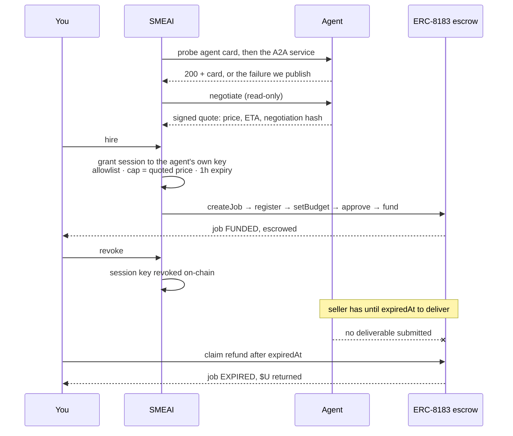

# SMEAI

**An agent marketplace for BNB Chain that calls every agent before it lists it.**

Live at **[smeai-dev.vercel.app](https://smeai-dev.vercel.app)** — reviewing it?
**[Start here](https://smeai-dev.vercel.app/start)** is the short path: every
claim, where to check it, and a working hire in one click. No wallet needed.

**[Watch the 110-second walkthrough](docs/demo.mp4)** — a real screen recording of
the deployed site: an agent is hired, quotes a price, and the on-chain proof
follows. No narration, no mock-ups. Recorded 3 September; the hire it shows works
the same way today, but it predates MCP probing, the completed ERC-8183
lifecycle and the feedback written back to the registry, so the counts on screen
are lower than the ones live now.


*Captured 6 September, before MCP support: it reads 69 hireable where the live
site now reads 107.*

---

## The problem, in numbers

The BSC agent registry doesn't have a discovery problem. It has a trust problem.

Measured 6 September 2026 — the live site always shows current figures, and
the registry grows by roughly 4,500 identities a day, so treat these as a
snapshot rather than a constant:

| | |
|---|---|
| Agents in the ERC-8004 identity registry on BSC mainnet | **304,787** |
| Of those, marked by 8004scan as having a verified endpoint | **5** |
| Agents on BSC testnet, where most Agent Studio builders register | 2,132 |
| Of those, verified | **0** |

A marketplace that lists everything buries the user in registration spam. One
that lists only what is "verified" shows five agents. SMEAI is the honest
middle: we verify the agents we list, and we publish the evidence.

## Verifying twice, because once is not enough

Most directories check that an agent serves an `agent-card.json` and call it
live. We did too, at first. Then we called the service behind the card and found
agents serving a flawless card whose A2A endpoint returned `404`.

Checking the card is checking the shop window and calling it a shop. So every
run does both:

| | Measured 9 Sep 2026 |
|---|---|
| Classified into the four categories | 421 |
| Serve a valid agent card | 136 |
| **Whose service actually answers — hireable** | **107** |

29 agents would have been listed as working by a card-only check. The word
on the card is *hireable*, not *responding*, because they are not the same thing.

### Asking in the wrong language is not asking

Calling twice is not enough either if you call in a protocol the agent does not
speak. MCP is JSON-RPC over POST, and our probe was sending it a `GET`: some
servers answered with a descriptive JSON blob that looked enough like an agent
card to pass, while their actual server was never addressed at all.

19 agents in the registry declare MCP and no other protocol. Under a `GET`,
**none of the nineteen could ever be marked hireable** — not because they were
down, but because we never spoke to them. Asked properly — `initialize`, then
`tools/list` — the working ones answer immediately, and one of them turns out to
publish 22 tools.

| Measured 9 Sep 2026 | Before | After |
|---|---|---|
| Rebalancing | 45 | 49 |
| Grid trading | 13 | 16 |
| Yield optimisation | 25 | 31 |
| Health factor | 9 | **17** |
| **Hireable total** | **90** | **107** |

All 17 are attributable to the MCP handshake; no agent changed state for any
other reason. The thinnest category on the site nearly doubled, and it had been
thin partly because we were measuring it with the wrong instrument.

The byte cap on that handshake was wrong at first, and the failure is
instructive: it was set to 12 KB, but a `tools/list` carries the full JSON
Schema of every tool — 30 KB for the Venus MCP server, 52 KB for Aave. The
responses arrived truncated, failed to parse, and both healthy servers were
recorded as listing no tools. A bug of ours, filed in their record. The cap is
now 256 KB, and a response that does hit it is reported as *truncated* rather
than as *empty*.

## What it does

1. **Resolves** the ERC-8004 registry on BSC mainnet (chain 56,
   `0x8004a169…`) and testnet (chain 97, `0x8004a818…`), pulling every declared
   A2A, MCP and web endpoint. Network is labelled on every listing: a testnet
   agent can only answer about testnet state, and we measured one returning a
   confidently formatted, materially wrong answer for exactly that reason.
2. **Classifies** into rebalancing, grid trading, yield optimisation and health
   factor monitoring with deterministic, evidence-backed rules rather than
   embeddings alone. Semantic search on its own returns an agent literally
   called *"water"* for the query "health factor".
3. **Calls** the card, then the service, recording status, latency and body —
   in whichever protocol the agent declares. A2A gets JSON-RPC; MCP gets a real
   handshake (`initialize`, then `tools/list`), because MCP is POST and a GET
   against an MCP server measures the door rather than the house.
4. **Asks the price.** Where an agent exposes an ERC-8183 `negotiate` skill we
   request a real quote — the same read-only step a buyer takes before hiring.
   The price, delivery estimate and signed negotiation hash shown on an agent's
   page are what that agent returned, not our estimate.
5. **Detects cloned identities.** Dozens of listings share an owner and a
   backend with each other — one operator wearing many hats. A backend with
   fifty registered identities is not fifty agents; unpenalised they scored
   100 and filled the front page. They are scored down and labelled, not
   hidden, and the live count is on the home page because it keeps growing.
6. **Follows the money.** Every job we fund is re-read from the ERC-8183 kernel
   on the same schedule, so the catalogue can answer the question that decides
   whether a marketplace is worth anything: of what was paid for, how much was
   delivered. The answer today is none of it, and it is on the site.
7. **Commits** each run, so the verification history is versioned and auditable
   instead of being a claim in a pitch.

Failing agents are shown, dimmed, with the failure visible. Hiding them would
make SMEAI another directory that pretends everything works.

### Take the data without asking us

Public JSON, open CORS, no key and no signup — read from the same snapshot the
pages render, so the API cannot drift from the site.

```bash
curl https://smeai-dev.vercel.app/api/agents?hireable=true
curl https://smeai-dev.vercel.app/api/agents?category=health&limit=5
curl https://smeai-dev.vercel.app/api/jobs
```

## Hiring an agent


Two paths, both real.

**Send a task over A2A.** The console dispatches a real `message/send` and
prints exactly what comes back, failures included. The payload is prefilled from
the skill the agent documents on-chain, so pressing Send without editing
anything works — an early version prefilled `{"skill":"negotiate"}` and the
agent replied `Invalid request format: 'task_description'`, which is a dead end
dressed as a feature.

Real agents expose *named skills*, not a chat box:

```json
{ "error": "unknown skill: None",
  "skills": ["negotiate", "notify_funded"],
  "hint": "send the skill envelope as an A2A data part" }
```

**Or hire on-chain, inside limits you can see.** Every agent holds its own key.
Hiring one grants *that key* — and only that key — scoped authority over the
treasury through [Altana](https://docs.altana.network): the four ERC-8183
contracts a hire needs, capped at five times the price the agent itself quoted,
expiring in an hour, recorded in the public Keystore. The agent then funds an ERC-8183 job in
escrow itself, and you can revoke it in one transaction without touching any
other agent's authority.

This is Altana's *"run a portfolio with multiple agents"* pattern: several agents,
one treasury, a separate scoped session each. Two agent identities are live in
the Keystore at `0x6b8361C2…` against treasury `0x4Cda2a93…`, verifiable by anyone
without asking us.

Agent keys are derived deterministically, so there is no session state to lose —
the session is rebuilt from the agent's identity rather than remembered. That
matters more than it sounds: an earlier version kept sessions in process memory
and would have failed intermittently on serverless, where the next request lands
on a different instance.

The scoping is enforced on-chain, not decorative. Three separate refusals proved
it during development: `UnauthorizedCall` when the EvaluatorRouter was missing
from the allowlist (naming the exact contract), `NoSpendPermissions` when the
policy covered $U but not the native relay fee, and `ExceededSpendLimit` on a
second same-day hire. None of those are bugs; they are the policy working, and
the UI says so in plain language rather than printing a revert.

That last one changed the design. Because agent keys are deterministic, spend
accrues *per agent* and granting a fresh session does not reset it — correct
behaviour, since an agent should not be able to escape its cap by asking for a
new session, but with the cap set to exactly one hire it meant the second hire
of the day was refused. Indistinguishable from breakage to anyone trying it.
The cap is now five times the quoted price: still derived from what the agent
charges, still a real limit, with room to actually use it.

> **If you are integrating Altana on BSC Testnet:** do not use
> `ERC8183_ADDRESSES[97].policy` from the SDK. Funding a job with it reverts
> with `PolicyNotWhitelisted()`. The router exposes `policyWhitelist(address)`
> as a public getter; the address it returns `true` for is
> `0xd6a4217588F6B1F5657a92A3e94E6422aD771cEA`. The SDK constant is stale
> against the deployed router. This cost us hours; it should cost you none.

Every category page carries the same breakdown of where its supply goes, so the
thinnest category gets the same treatment as the richest one:


*Captured 6 September, when this category showed 56 listed and 5 hireable. The
live page reads 77 and 17: the jump is not new agents arriving, it is the MCP
handshake described above finally asking the MCP-only ones in their own
language. The screenshots in this README are dated on purpose — the live site is
the number that counts.*

## Does hiring an agent actually beat doing it yourself?

[`/report`](https://smeai-dev.vercel.app/report) answers that with three real
tasks run both ways — once through an agent, once by reading the contracts
directly — with both outputs attached unedited.

The agents win two and lose one. The loss is the most useful result: asked
whether a real Venus borrower was near liquidation, the direct read returned
$498 of excess liquidity across two markets, while the agent returned
`"positions": []` with a completed status and no error. It was reading testnet
for a mainnet address. For a liquidation-risk agent, silence would be safe and
an error would be safe; "you have no position" is the one answer that gets
someone liquidated.

Reproduce it with `node scripts/advantage-report.mjs`.

## How a hire runs



The order matters. Nothing is signed before the agent has quoted a price, and
the spend cap is derived from that quote rather than chosen by us. The session
is scoped before it is used and can be revoked after, in one transaction,
whether or not the agent agrees.

The tail of that diagram is not the happy path. It is the one every job we
funded actually took: the seller stayed silent past the deadline. We ran the
refund on one of them to prove it works and left the other eight as they are.

## Proof: it runs, and the chain remembers

Not a lab exercise — the testnet hashes were produced by clicking the buttons on
the live site, and resolve on [BSC Testnet](https://testnet.bscscan.com). The
mainnet ones were run once by hand and resolve on [BscScan](https://bscscan.com).

| What | Evidence |
|---|---|
| Session granted to an agent's own key | [`0xbf3c0b94…`](https://testnet.bscscan.com/tx/0xbf3c0b94a63836c45fbb3becff106755bf560b804af5d5348ed3152273c7a1b7) |
| ERC-8183 job funded in escrow (job 935) | [`0x2e974cad…`](https://testnet.bscscan.com/tx/0x2e974cad25b377b40965816e9ab60fbc59f5d6a675a1e790807237c207d8f229) |
| Session revoked | [`0x338661e6…`](https://testnet.bscscan.com/tx/0x338661e6fd184e1edaacd04fa9b509873c85b1c30867e3910d91c9ed0e1374bc) |
| Treasury funded from the $U faucet | [`0x8b559b2b…`](https://testnet.bscscan.com/tx/0x8b559b2b882093125036c3ef4068275a9e584f197359555cd9a468651c586724) |
| Escrow reclaimed from an undelivered job (job 881) | [`0xa489fc36…`](https://testnet.bscscan.com/tx/0xa489fc36ae2ead50881f9301ba65d283061d1929291690b1fa5973c058e75377) |

**10 jobs funded · 8 session keys registered in the public
[Keystore](https://testnet.bscscan.com/address/0x6b8361C29d05D498b1a12B54A37310f94171E94A)**
against treasury [`0x4Cda2a93…`](https://testnet.bscscan.com/address/0x4Cda2a93054F2Ab639b4A95C261874a77A0Af6FA).

Getting there took three refusals from the chain, and those are the interesting
part: `UnauthorizedCall` when a contract was missing from the session allowlist
— the revert named the exact contract — `NoSpendPermissions` when the policy
covered $U but not the native relay fee, and `ExceededSpendLimit` on a sixth
same-day hire of an agent whose cap covers five. None of the three were bugs in
the scoping. They were the scoping, enforced by the chain rather than by us.

### What happened after we paid

This is the part a listing never shows, and it is the least flattering thing we
know: **of those 10 jobs, not one seller ever submitted a deliverable.** The
money sat in escrow until the deadlines passed.

That is not a failure of the escrow. The escrow did precisely its job by holding
the funds instead of forwarding them, and ERC-8183 gives the buyer a way out
when the seller goes quiet. We have run that recovery twice — jobs 881 and 882 — to prove the
path works rather than describing it — the job moved from `FUNDED` to `EXPIRED`
and the $U returned to the buyer ([`0xa489fc36…`](https://testnet.bscscan.com/tx/0xa489fc36ae2ead50881f9301ba65d283061d1929291690b1fa5973c058e75377),
receipt `success`, block 128758990). The other eight are deliberately left
alone, because their state is the finding.

`scripts/jobs.mjs` re-reads every job from the kernel on the same cron, so `data/jobs.json` and [`/api/jobs`](https://smeai-dev.vercel.app/api/jobs)
stay honest about it. None of these sellers are ours.

### And once on mainnet, with real funds

Everything above is testnet. To show the same flow settles with real money, we
ran it **once** on BSC Mainnet and recorded it. Job **#56693** is funded in the
mainnet ERC-8183 kernel against a provider that is not ours
([`0x73809F69…`](https://bscscan.com/address/0x73809F69916FcF7Ddc5BB1315fBdf96A569a5963)),
for 0.10 $U.

| What | Evidence |
|---|---|
| Session granted in the mainnet Keystore | [`0xf5b8ef85…`](https://bscscan.com/tx/0xf5b8ef85f58d89e908d7c574332619c7352ad8082a4472425949c9ed9745739e) |
| ERC-8183 job funded (job 56693) | [`0x01c58b85…`](https://bscscan.com/tx/0x01c58b850a865d8dc3f787d78968243917d652d3473918c83febb850624097a4) |
| Session revoked | [`0x5ce5e4e1…`](https://bscscan.com/tx/0x5ce5e4e1bbb5898992422560f67e272009d3f1c8576fe230a551a0356d23d7c9) |

Total cost: 0.001677 BNB plus the 0.10 $U escrowed.

The mainnet dispute window is **7 days**, against fifteen minutes on
testnet. Reusing the testnet deadline would have produced a job whose expiry
falls inside that window — one that can never complete, which is the state
thousands of mainnet jobs are stuck in. `scripts/mainnet-demo.mjs` reads
`disputeWindow()` from the policy instead of copying a constant that happened to
work on another chain.

Both networks show up in Altana's own key registry — the sessions on
[mainnet](https://explorer.altana.network/account/0x4Cda2a93054F2Ab639b4A95C261874a77A0Af6FA) and the fuller record on
[testnet](https://testnet.altana.network/account/0x4Cda2a93054F2Ab639b4A95C261874a77A0Af6FA), where 13 keys and 18
events are recorded. Expect to find them marked **Expired** and **Revoked**:
sessions are scoped to an hour and revoked once the work is done, so one still
live would mean authority left lying around. That registry tracks keys, not
jobs — job 56693 is on BscScan, not there.

One integration note worth writing down: importing this wallet's key into
MetaMask silently breaks the flow. MetaMask upgrades the account to its own
EIP-7702 delegator, Altana's relay then simulates against unfamiliar code, and
the only symptom is a revert with empty data. `scripts/clear-delegation.mjs`
restores the account.

## Getting an agent listed

There is no application, no review queue and no fee. Nobody here decides who
appears: register on ERC-8004 with an endpoint that answers, and the next run
finds you — the catalogue re-reads the registry several times a day.

What happens then is the same for everyone. We fetch the agent card, then call
the A2A service behind it, and publish both results with their status, latency
and timestamp. Expose an ERC-8183 negotiation skill and your price appears too.

Two things lower a score, and neither removes anyone: sharing a backend with
other registered identities, and declaring an endpoint no public client can
reach. **Failing agents are never delisted** — they are shown, dimmed, with the
failure and the moment it was measured. A marketplace that quietly drops what
stops working is one you cannot trust when it says something works.

Three listings are ours, published so the thinnest categories always have
something that answers: [331625](https://bscscan.com/address/0x8004A169FB4a3325136EB29fA0ceB6D2e539a432)
reads Venus health factors, 331698 reads PancakeSwap V3 ranges, and 331794 works
out whether a grid step covers its own costs. All three are labelled and
excluded from every figure on this site.

## Is the answer right?

Everything above measures whether an agent *responds*. The harder question is
whether it is *correct*, and for most of this catalogue it still cannot be
asked: the agents that take payment never delivered anything to grade.

MCP changed that for the part of the catalogue that speaks it. An MCP server
answers on the spot and for free, so there are finally answers to grade. Each
check asks an agent something whose correct answer we read ourselves, from the
contract, at the same moment — never against an opinion, and never against
another agent.

The first comparison is why there is more than one sample, and it is worth
writing down. The Venus MCP server reported a borrow limit of `623.59` while the
Comptroller said `643.13` — a 3% error, and a single-shot check would have
published exactly that. Three samples later the same agent matched the chain
**to the cent**. It was not wrong. It was serving cache.

So a verdict is drawn from every observation kept, not from the last run:

| Verdict | Means |
|---|---|
| `match` | Agreed with the chain in every observation |
| `stale` | Matched exactly at least once, so the arithmetic is right; other times it served a cached value, and we report how far behind |
| `divergent` | Never came within tolerance of the chain |

One exact match is enough to rule out bad arithmetic — hitting the chain to the
cent does not happen by accident. Publishing that first 3% reading as a failure
would have been our own measurement error, filed as somebody else's defect.

A cached answer is not a wrong answer and this site will not call it one. It
still matters: on a liquidation-risk question, a figure a few percent behind the
chain is the difference between acting and not.

The checks are written by hand, one per line, and every tool named in them is a
read. These MCP servers expose `borrow`, `repay` and `mintToken` in the same
list as the getters; discovering tools and calling them to see what happens is
how you lose somebody else's money. A test asserts that no write operation can
appear in the table.

Reproduce with `node scripts/outcome-check.mjs`.

## Giving the measurement back

The registry is not short of agents. It is short of signal: of the ~310,000
identities on BSC, its own indexer marks six as having a verified endpoint. We
have been calling those endpoints every few hours for a week and keeping each
result, and until now that record lived only on this site.

So it is written back. Feedback records now sit on the ERC-8004 Reputation
Registry at `0x8004BAa1…`, signed by the SMEAI treasury. That address was not
copied from a blog post: the contract answers `getIdentityRegistry()` with
`0x8004A169…a432`, the identity registry this project already reads, so the two
are linked on-chain and the link is what proves it is the right contract.

Each record points at a document that carries the measurement, the method that
produced it, and the five ways that method can be wrong — including that we both
measure and publish it. A reputation record that does not say how it can be
wrong is an opinion in the shape of a datum.

Two deliberate limits, and both cost us headline numbers:

**Nothing negative is published.** A permanent record saying somebody's agent was
down on a Tuesday does not heal when they fix it. Failures are already on this
site with the moment they were measured, where the next run corrects them. What
the registry lacks is positive signal that somebody actually checked, so that is
what goes in.

**One record per backend, not per identity.** 41 registrations met the bar; they
resolve to 4 operators. Filing 41 records would have been us doing the precise
thing this project exists to measure — inflating a registry with entries that
look like more than they are. Each document names how many identities share the
backend it describes.

One class of agent is excluded for a reason worth stating: until 9 September we
probed MCP servers with a `GET`, so several accumulated ~50 runs recorded as
down through a fault of ours. That history is not published. Turning our own bug
into somebody else's permanent reputation would be the worst version of this
tool, and the 100%-only bar excludes them on its own — but the exclusion is
checked explicitly, so it stays true if the bar ever moves.

Reproduce it with `node scripts/publish-feedback.mjs`, which prints who would be
written about and why, and touches nothing without `--confirm`.

## What this is not

- **Not a mainnet product.** The hiring console on this site is BSC Testnet end to end, and pressing it costs nothing. The same flow was run once on mainnet with real funds, by hand, and recorded below — there is no mainnet button, because every visitor pressing one would spend our money.
- **Not a correctness check for most of the catalogue — and the reason is a finding, not an omission.** Checking that an answer is *right* requires having the answer. The agents that quote do not hand one over: ask the highest-scoring health-factor agent on mainnet for a health factor and it replies `unknown skill`; ask it for a quote and it accepts, prices the work at 0.10 $U and requires an ERC-8183 escrow first. We funded eleven of those escrows across both networks. **Not one seller ever submitted a deliverable.** Where an agent *does* hand an answer over — which now means the MCP servers — we grade it against the chain; see below. For everyone else, a fast, confident, wrong agent would still pass every check here.
- **Not a full sweep of the registry.** We verify the agents we list, not the 304,787 entries on BSC — a number that grows every day.
- **Not a reputation system.** Almost no agent on BSC carries on-chain feedback, so we still display no score we cannot source. What changed is the other direction: we now write our own measurements back to the Reputation Registry, positive only and one record per backend. That is us contributing a signal, not us scoring the ecosystem.
- **Not audited.**

The full version, including the DNS-rebinding window we chose to accept, is on
the [scope and risk](https://smeai-dev.vercel.app/scope) page.


## Running it

```bash
pnpm install
node scripts/ingest.mjs   # writes data/snapshot.json
node scripts/jobs.mjs     # writes data/jobs.json (reads the ERC-8183 kernel)
pnpm dev
```

`SCAN_API_KEY` is optional — without it the ingest self-throttles and takes
longer. `ALTANA_ADMIN_KEY` (a funded BSC Testnet key) enables on-chain hiring;
without it that panel says so plainly rather than pretending.

### Checks

```bash
pnpm test       # 37 assertions, a few seconds, no network required
pnpm typecheck  # runs `next typegen` first — see below
pnpm lint
pnpm build
```

`typecheck` generates route types before running `tsc`, and that is not
decoration. `PageProps` and `LayoutProps` are written by Next into `.next/types`,
so on a clean checkout — which is what CI gets — `tsc` sees three names that do
not exist. It passed locally only because a stale build happened to be lying
around. Running `next typegen` inside the script means the check does not depend
on what a machine happens to have left over.

All four run on every push and pull request. The build is in there for a
specific failure this repository could not otherwise see: when a commit breaks
the build, Vercel's deploy fails and **the previous deployment stays up**, so
every route still answers 200 and the uptime check goes green over a repository
that no longer publishes. During a two-week judging window nobody is watching
for that.

The tests are not about clicking through pages — `scripts/site-check.mjs`
already calls all 16 published routes every half hour. They assert the claim the
rest of the site rests on: that the agents we publish ourselves are counted
nowhere. That guarantee has broken once. On 9 September the completed-lifecycle
job landed in `data/jobs.json`, because the filter matched on the buyer and the
buyer was our treasury either way, and for a few minutes the site read *"11 jobs
against agents we do not control, 1 produced a deliverable"* — presenting our own
delivery as a stranger's. It was caught by hand. The assertion that catches it
now is checked against that exact file.

Writing them found a live bug too, described below.

## Architecture, and why it looks like this

No database. No always-on server. The snapshot is a JSON file imported at build
time, refreshed by a GitHub Actions cron. The cron asks for every 30 minutes;
GitHub throttles scheduled workflows on public repositories, so in practice it
lands several times a day. Nothing on the site rounds that away: every figure
carries the timestamp of the run that produced it, so you read when it was
measured rather than when we hoped it would be.

That is a deliberate constraint. The most likely way to fail is for a free-tier
worker or a database to quietly expire halfway through a week. Nothing here can
go to sleep.

A run that returns drastically fewer agents than the last one aborts instead of
committing: 8004scan returns 500s occasionally, and publishing a degraded
catalogue over a good one would be worse than publishing nothing.

| Piece | Choice |
|---|---|
| Hosting | Vercel |
| Verification cron | GitHub Actions |
| Registry index | 8004scan API |
| Agent probing | Direct HTTPS to each agent |
| On-chain hiring | Altana SDK, ERC-8183 escrow, BSC Testnet |

## Calling untrusted endpoints safely

Every URL SMEAI touches was written by a stranger: anyone can register an
ERC-8004 agent pointing anywhere. The registry contains endpoints aimed at
loopback, including `http://localhost:3000/...`. During an early local ingest
those made the app fetch *itself* and record its own 404 as the agent's
answer — a security bug and a data-integrity bug at once.

Both the ingest and the API routes send outbound requests through
[`src/lib/net-guard.mjs`](src/lib/net-guard.mjs), which requires HTTPS on the
standard port, resolves the hostname and rejects any answer in a private,
loopback, link-local or CGNAT range. Hostname blocklists are not enough:
`127.0.0.1.nip.io` resolves to `127.0.0.1`. Redirects are not followed, bodies
are read with a hard byte cap, and the hire route accepts only endpoints already
present in the snapshot.

This costs no catalogue depth. Every blocked endpoint was cleartext HTTP
pointing at a private address, and no responding agent relied on one. An agent
whose endpoint is `localhost` was never hireable by anyone, so it is shown as
*not publicly reachable* rather than mislabelled as down.

That guard had a hole in it, and the first run of the new tests found it.
IPv4-mapped IPv6 addresses were being waved through: the check looked for the
dotted form `::ffff:127.0.0.1`, but `new URL()` normalises the host to
compressed hex, so what actually reached the comparison was `::ffff:7f00:1`. It
matched nothing, fell through to the public branch, and was allowed.

| Endpoint an attacker could register | Host after `new URL()` | Was |
|---|---|---|
| `https://[::ffff:127.0.0.1]/` | `[::ffff:7f00:1]` | allowed |
| `https://[::ffff:169.254.169.254]/` | `[::ffff:a9fe:a9fe]` | allowed |
| `https://[::ffff:10.0.0.1]/` | `[::ffff:a00:1]` | allowed |

The second row is the cloud metadata endpoint on AWS, GCP and Azure, reachable
by anyone willing to register an ERC-8004 agent pointing at it. Both notations
are now decoded, and a `::ffff:` suffix that cannot be parsed is refused rather
than assumed public — an address we cannot read is not an address we can call
safe. The five cases are asserted in
[`tests/net-guard.test.mjs`](tests/net-guard.test.mjs).

## Why a verification is not a guarantee

A check is a point-in-time fact. An agent that answered four minutes ago can be
down now — which is why every status here carries the moment it was measured
rather than a permanent badge, and why each agent shows the history of every
check we have run against it rather than only the last one.

The limits of what we verify, and the one security trade-off we deliberately
accepted, are on the [scope and risk](https://smeai-dev.vercel.app/scope) page
rather than repeated here.

## Stack

Next.js 16 · TypeScript · Tailwind CSS v4 · viem · Altana SDK · deployed on Vercel

## License

[MIT](LICENSE). Take it and use it — including, if it comes to that, whoever
ends up running it.
